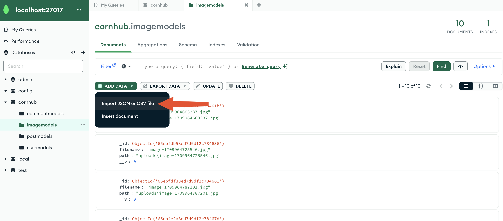

# React + Vite

This template provides a minimal setup to get React working in Vite with HMR and some ESLint rules.

Currently, two official plugins are available:

- [@vitejs/plugin-react](https://github.com/vitejs/vite-plugin-react/blob/main/packages/plugin-react/README.md) uses [Babel](https://babeljs.io/) for Fast Refresh
- [@vitejs/plugin-react-swc](https://github.com/vitejs/vite-plugin-react-swc) uses [SWC](https://swc.rs/) for Fast Refresh

This project uses HTML, CSS, Tailwind, React, JavaScript.
(Backend coming soon)

`Nodejs third-parties`:
cors,
dotenv,
express,
multer,
mongoose,
express-session,
connect-mongodb-session

`React Libraries`:
react-dom,
react-router-dom
react-dropzone

**To install dependencies**

- Run these commands in the main folder directory

```
cd backend
npm install
cd ..
cd frontend
npm install
cd..
```

**To run the servers**

```
npm start
```

**If that doesn't work to run**
Make sure to run this command in different terminal/command prompt sessions in the same directory.

```
cd backend
npm run dev
```

```
cd frontend
npm run dev
```

## Sample data

All the sample data can be taken under the samples folder. To try, run the backend first. In MongoDB Compass, connect to mongodb://localhost:27017. Then import the json files to its respective collections.

Images used for posts and profiles pictures can be taken from the samplesImages folder inside the samples folder too but placed them to the uploads folder (Don't change the name of the files) for it to show in the web.

As always, stay corny:)
